# Manual de usuario — SimpleInmo

Guía completa para operar el ERP inmobiliario de punta a punta: desde el ingreso hasta el portal público, pasando por propiedades, contratos, cobros, mantenimiento y atención comercial.

> Este manual está pensado para el equipo de la **inmobiliaria** (administrador, agentes y roles operativos). No incluye funciones de administración técnica de la plataforma SaaS.

---

## Índice

1. [Cómo empezar](#1-cómo-empezar)
2. [Orden de trabajo recomendado](#2-orden-de-trabajo-recomendado)
3. [Dashboard](#3-dashboard)
4. [Ajustes de la inmobiliaria](#4-ajustes-de-la-inmobiliaria)
5. [Usuarios y roles](#5-usuarios-y-roles)
6. [Complejos y unidades](#6-complejos-y-unidades)
7. [Propiedades](#7-propiedades)
8. [Contratos](#8-contratos)
9. [Expensas](#9-expensas)
10. [Cobros](#10-cobros)
11. [Mantenimiento](#11-mantenimiento)
12. [Rendiciones](#12-rendiciones)
13. [Consultas](#13-consultas)
14. [Visitas](#14-visitas)
15. [Turnero](#15-turnero)
16. [Portal público](#16-portal-público)
17. [Flujo completo de ejemplo](#17-flujo-completo-de-ejemplo)
18. [Preguntas frecuentes](#18-preguntas-frecuentes)

---

## 1. Cómo empezar

### Ingreso

1. Abrí la URL del sistema (por ejemplo `https://tu-dominio` o `http://localhost:3001` en local).
2. Ingresá tu **email** y **contraseña**.
3. Si pertenecés a más de una inmobiliaria, elegí con cuál trabajar.

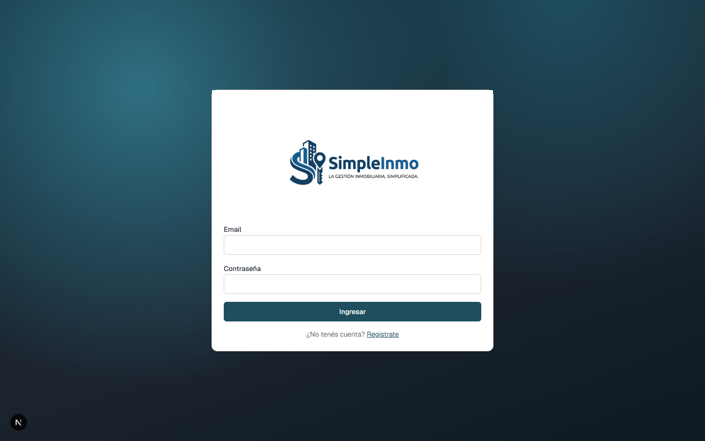

### Menú lateral

Una vez dentro vas a ver el menú a la izquierda. Los ítems disponibles dependen de tu **rol** y de los **módulos** habilitados para tu usuario.

| Módulo | Para qué sirve |
|--------|----------------|
| Dashboard | Resumen del mes |
| Propiedades | Portfolio de alquiler/venta |
| Complejos | Edificios y unidades |
| Contratos | Alquileres vigentes |
| Cobros | Cuotas y pagos |
| Expensas | Prorrateo por complejo |
| Mantenimiento | Órdenes de trabajo |
| Rendiciones | Liquidación a propietarios |
| Consultas | Leads del portal |
| Visitas | Agenda de visitas del portal |
| Turnero | Turnos presenciales en sucursal |
| Usuarios | Alta de personas (solo admin) |
| Ajustes | Datos de la inmobiliaria (solo admin) |

---

## 2. Orden de trabajo recomendado

Para poner la inmobiliaria en marcha seguí este orden:

```text
Ajustes → Usuarios → Complejos/Unidades → Propiedades
        → Contratos → Expensas → Cobros → Mantenimiento → Rendiciones
        → Portal (Consultas + Visitas)
```

1. **Configurá** la inmobiliaria (nombre, monedas, link del portal).
2. **Cargá personas**: agentes, propietarios, inquilinos, proveedores.
3. **Armá el stock**: complejos/unidades y propiedades publicables.
4. **Formalizá alquileres** con contratos.
5. **Operá el mes**: expensas → cuotas → cobros → OT → rendiciones.
6. **Atendé demanda** del portal: consultas y visitas.

---

## 3. Dashboard

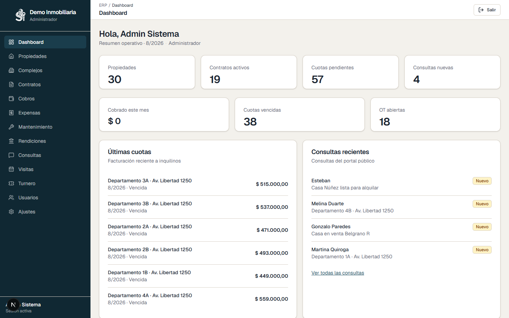

El dashboard muestra un resumen del período: propiedades, contratos activos, cuotas, consultas nuevas, órdenes abiertas y cobrado.

**Cómo usarlo**
- Hacé clic en las tarjetas para ir al módulo correspondiente.
- Revisá cuotas vencidas y consultas nuevas al empezar el día.
- El contenido se filtra según tu rol (un propietario no ve lo mismo que un agente).

---

## 4. Ajustes de la inmobiliaria

> Disponible para el rol **Administrador**.

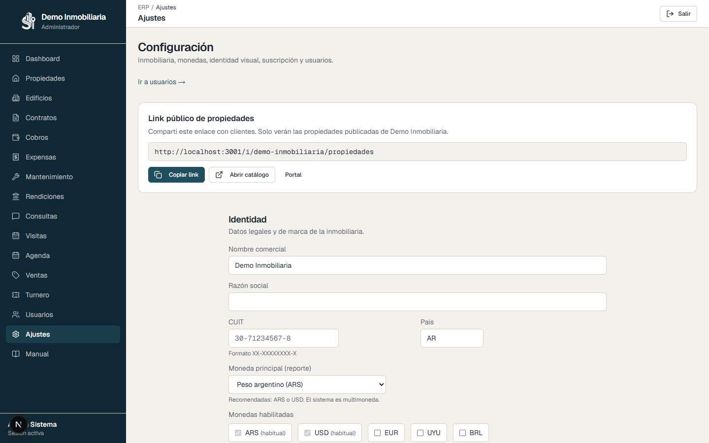

Acá configurás la identidad de la empresa y el catálogo público.

**Qué configurar**
- Nombre comercial, CUIT, domicilio, teléfono, WhatsApp.
- Logo y colores (tema visual).
- Monedas habilitadas (por ejemplo ARS y USD).
- **Link del portal público** (`/i/{tu-slug}/propiedades`): copialo y compartilo en redes o WhatsApp.

**Consejo:** guardá los cambios antes de publicar propiedades. El slug forma parte de la URL pública.

---

## 5. Usuarios y roles

> Disponible para el rol **Administrador**.

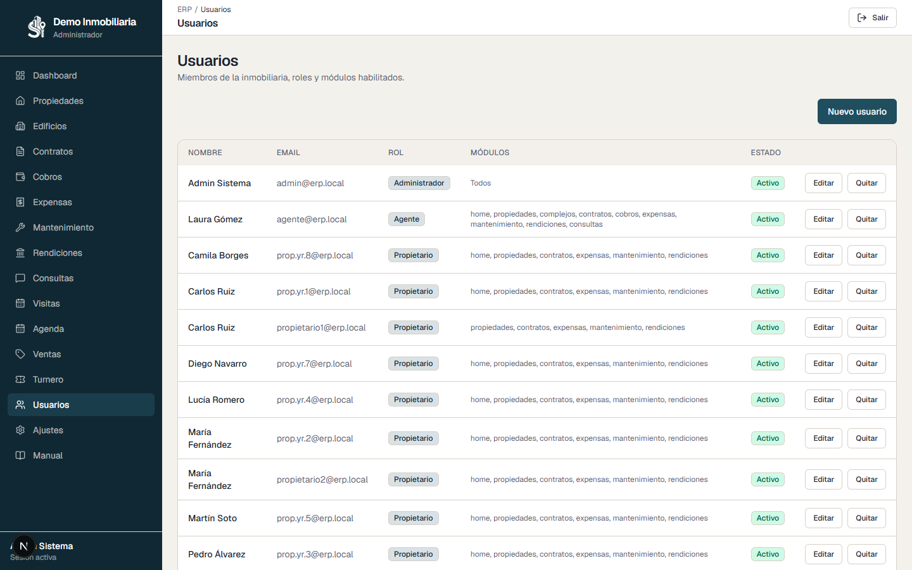

Cada persona que opera el sistema (o figura como propietario/inquilino/proveedor) debe existir como usuario de la inmobiliaria.

### Alta de usuario

1. Abrí **Usuarios** → **Nuevo usuario**.
2. Completá nombre, email, contraseña y rol.
3. Marcá los módulos a los que puede acceder (si aplica).
4. Guardá.

### Roles

| Rol | Qué puede hacer |
|-----|-----------------|
| **Administrador** | Todo el menú de la inmobiliaria, usuarios y ajustes |
| **Agente** | Operación diaria: propiedades, contratos, cobros, consultas, visitas, etc. |
| **Propietario** | Ve sus propiedades, contratos, expensas y rendiciones |
| **Inquilino** | Ve sus contratos, cuotas y mantenimiento |
| **Proveedor** | Interviene en órdenes de mantenimiento |
| **Solo lectura** | Consulta limitada |

**Importante:** creá primero a los propietarios e inquilinos antes de vincularlos en propiedades o contratos.

---

## 6. Complejos y unidades

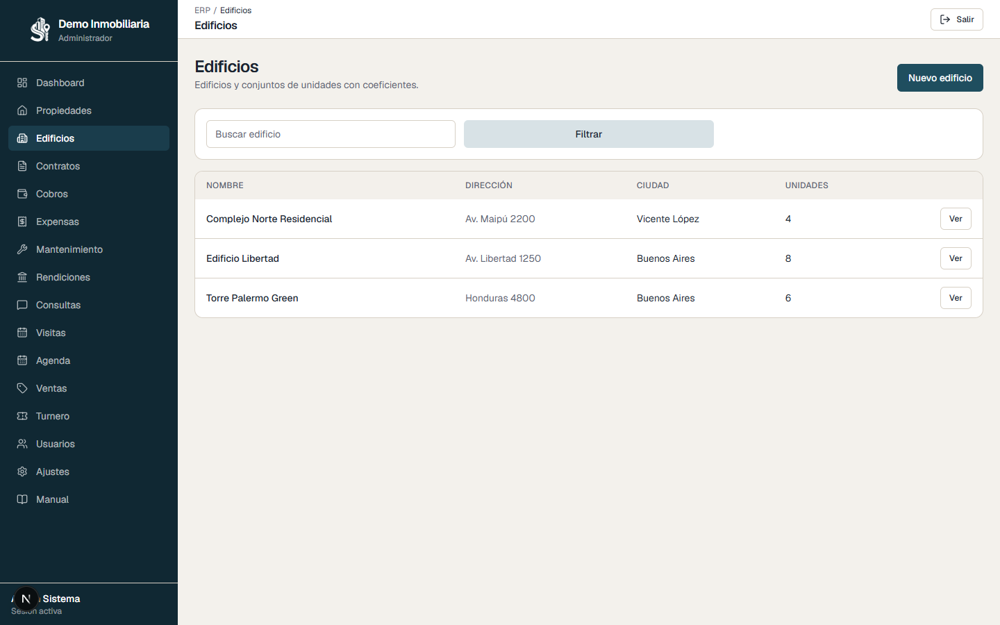

Los **complejos** son edificios o condominios. Cada uno tiene **unidades** (deptos, locales) con un **coeficiente** de prorrateo para expensas.

### Pasos

1. Creá un complejo (nombre, dirección, ciudad).
2. Entrá al detalle y **agregá unidades** (código, piso, coeficiente, m², ambientes).
3. Más adelante vinculá cada unidad a una **propiedad** del portfolio.

**Tips**
- Sin coeficientes correctos, las expensas no se prorratean bien.
- Una unidad sin propiedad vinculada aparece como “sin publicar”.

---

## 7. Propiedades

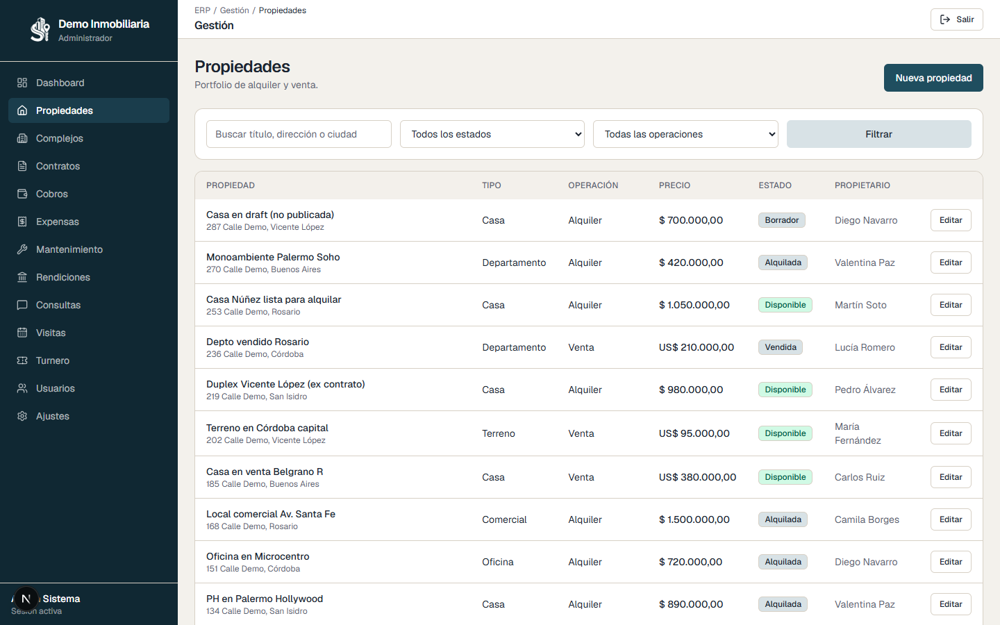


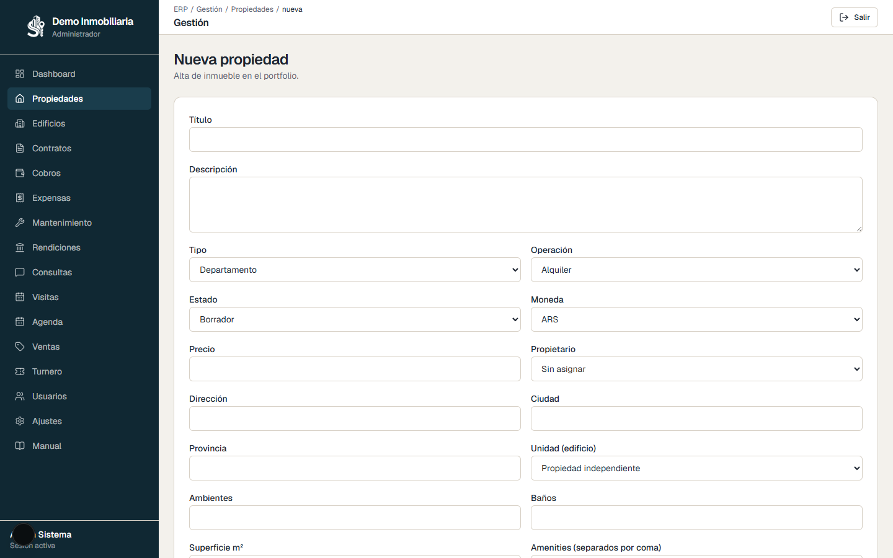

### Alta

1. **Propiedades** → **Nueva propiedad**.
2. Completá título, tipo, operación (Alquiler / Venta / Ambos), precio, ubicación.
3. Asigná **propietario** y, si corresponde, la **unidad** del complejo.
4. Definí el **estado**. Para aparecer en el portal usá **Disponible** (también se publican las **Reservadas**).
5. Guardá. En la edición podés subir **fotos** y video.

### Filtros

Usá búsqueda por título/dirección/ciudad, estado u operación para encontrar inmuebles rápido.

### Relación con el portal

| Estado | ¿Sale en el portal? |
|--------|---------------------|
| Disponible | Sí |
| Reservada | Sí |
| Alquilada / Borrador / Inactiva | No |

---

## 8. Contratos

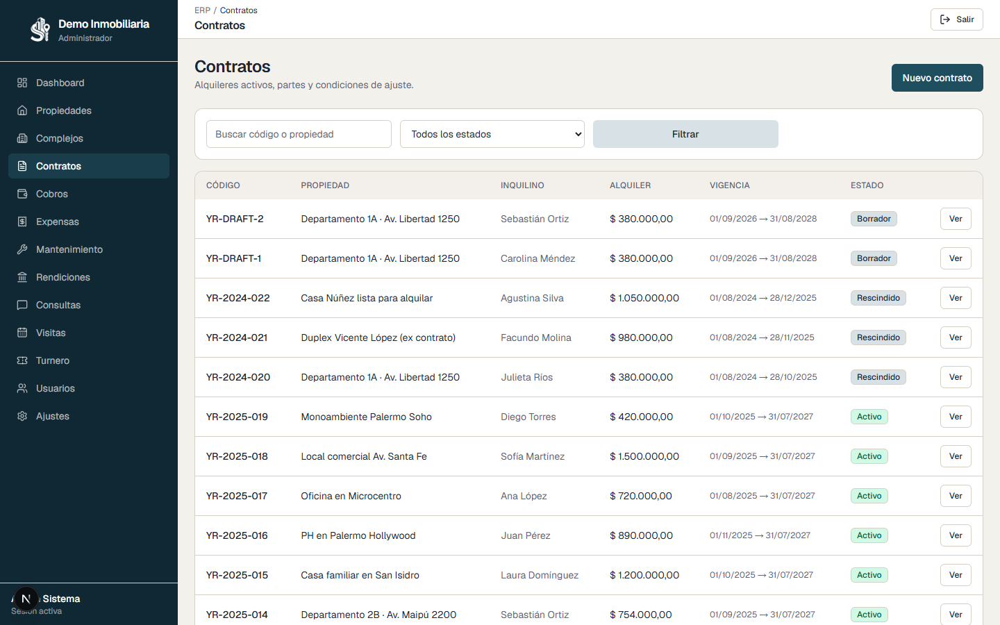

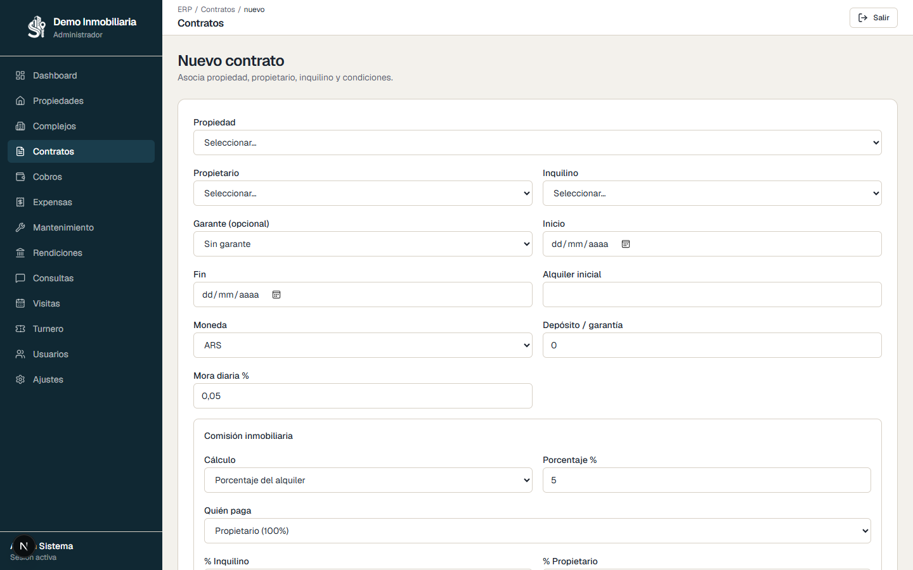

Los contratos formalizan el alquiler: partes, montos, índices y reglas de expensas.

### Alta de contrato

1. **Contratos** → **Nuevo contrato**.
2. Elegí propiedad, propietario, inquilino y garante (opcional).
3. Definí fechas, alquiler, depósito y % de mora.
4. Configurá el **índice** de actualización (ICL, IPC, %, fijo).
5. Indicá la **comisión** de la inmobiliaria y quién la paga.
6. Marcá si el contrato **incluye expensas** ordinarias/extraordinarias.
7. Guardá: el contrato queda **Activo**.

**Tips**
- El inquilino y el propietario deben existir como usuarios.
- Las reglas de expensas del contrato definen qué se suma a la cuota al generar cobros.

---

## 9. Expensas

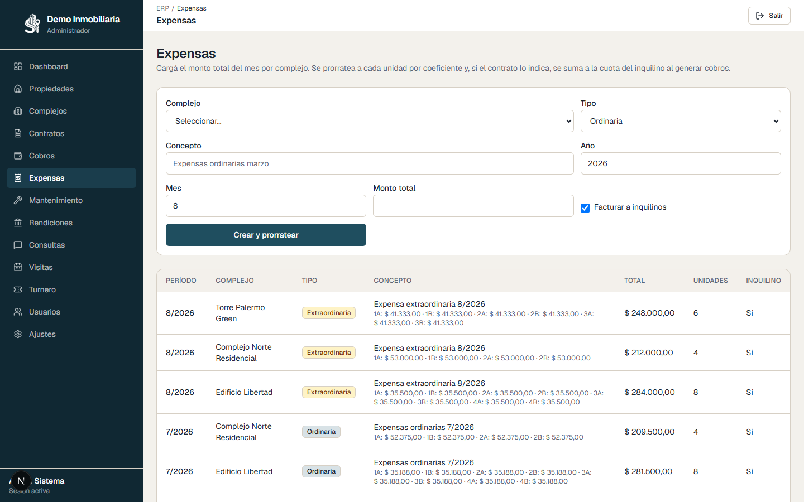

Cargás el total del mes por complejo y el sistema lo **prorratea** a cada unidad según su coeficiente.

### Cómo cargar

1. Elegí el complejo.
2. Indicá si es ordinaria o extraordinaria, el concepto y el período.
3. Ingresá el monto total.
4. Si corresponde, marcá **Facturar a inquilinos** (se sumará a la cuota al generar cobros).
5. Confirmá **Crear y prorratear**.

**Orden sugerido del mes:** primero expensas, después generar cuotas en Cobros.

---

## 10. Cobros

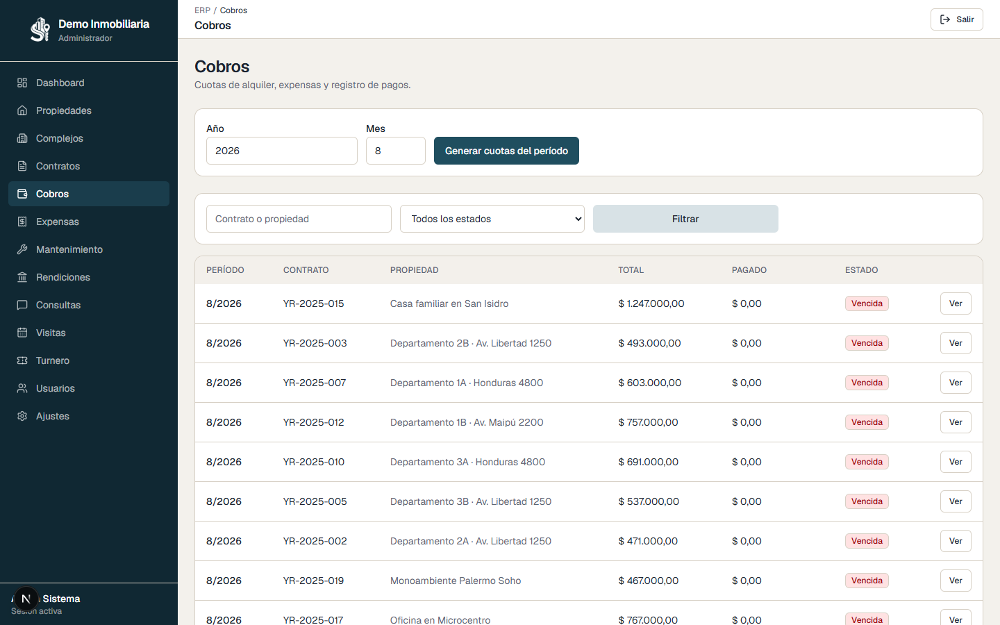

Acá viven las **cuotas** (alquiler + expensas + mora) y el registro de pagos.

### Generar cuotas del período

1. Como staff, usá **Generar cuotas del período**.
2. Elegí año y mes.
3. El sistema arma las cuotas de los contratos activos.

### Registrar un pago

1. Abrí la cuota.
2. **Registrar pago**: monto, medio (transferencia, efectivo, etc.), referencia y notas.
3. Descargá el **recibo PDF** si lo necesitás.

**Estados de cuota:** Pendiente · Parcial · Pagada · Vencida · Cancelada.

---

## 11. Mantenimiento

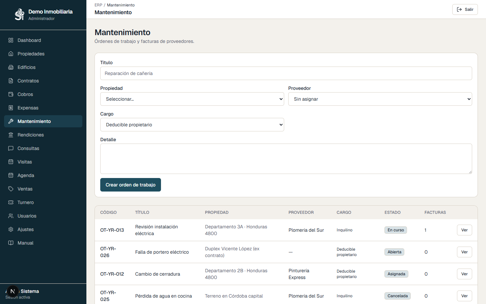

Gestioná **órdenes de trabajo** (reparaciones) y facturas de proveedores.

### Crear una OT

1. Título y propiedad.
2. Proveedor (usuario con rol Proveedor), si ya lo tenés.
3. Quién asume el costo: deducible propietario / inquilino / agencia.
4. Detalle del trabajo.

### Ciclo de vida

`Abierta → Asignada → En curso → Completada` (o Cancelada).

Los trabajos a cargo del propietario suelen impactar la **rendición**.

---

## 12. Rendiciones

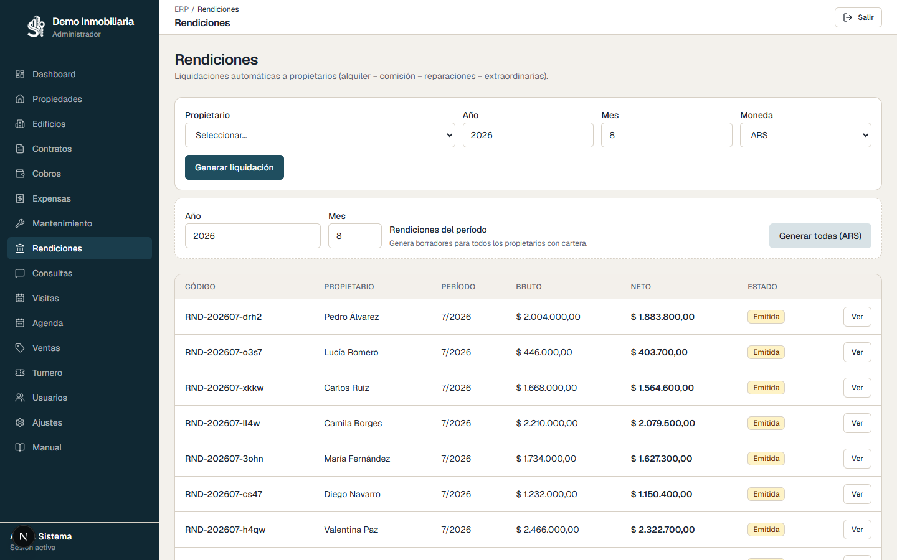

Liquidación al propietario del período:

**Alquiler cobrado − comisión − reparaciones − extraordinarias = neto a transferir.**

### Pasos

1. **Generar liquidación** (propietario, período, moneda).
2. Revisá el detalle (bruto, comisión, neto y líneas).
3. **Emitir** cuando esté correcta.
4. **Marcar pagada** al hacer la transferencia (podés cargar referencia).
5. Descargá el **PDF** para enviar al propietario.

---

## 13. Consultas

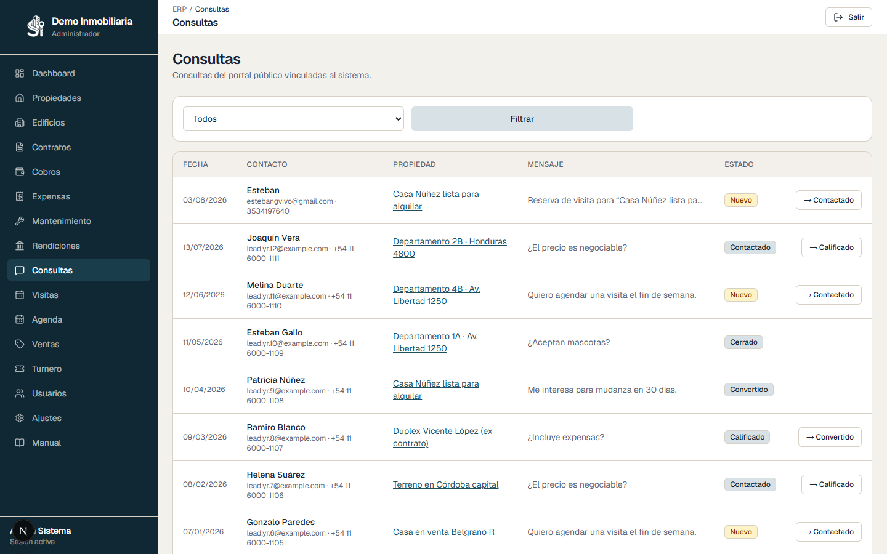

Inbox de interesados que escriben o agendan desde el **portal**.

**Qué hacer con cada consulta**
1. Leé el mensaje y la propiedad asociada.
2. Avanzá el estado: Nuevo → Contactado → Calificado → Convertido (o Cerrado).
3. Si viene de una visita, también revisá la agenda en **Visitas**.

---

## 14. Visitas

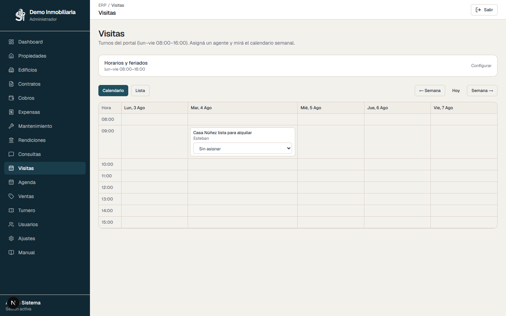

Agenda de turnos que los interesados reservan en la ficha pública.

### Configurar horarios (administrador)

En **Horarios y feriados** podés definir:
- Días de atención (por defecto lun–vie).
- Rango horario (por defecto 8:00–16:00, turnos de 1 hora).
- Feriados inamovibles de Argentina (desmarcá si ese día sí atienden).
- Días cerrados extra (puentes, vacaciones).

### Operar la agenda

- Cambiá entre vista **Calendario** y **Lista**.
- Asigná un **agente** a cada visita.
- Marcá **Completada** o **Cancelada** según corresponda.

Cada reserva también genera una **consulta** vinculada.

---

## 15. Turnero

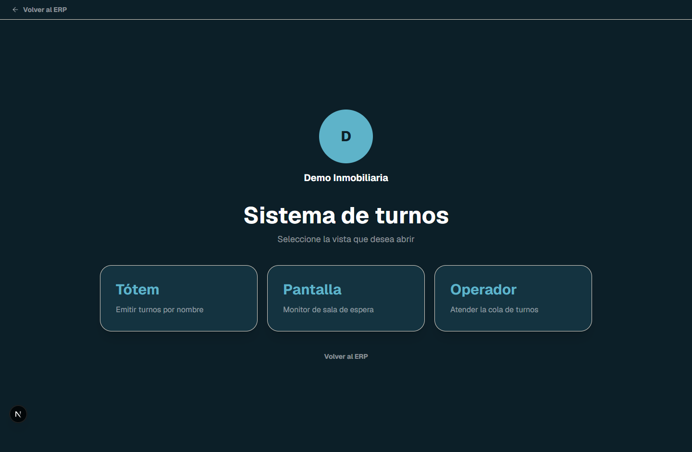

Cola de atención **presencial** en la sucursal (distinta de las visitas del portal web).

Abrí según el dispositivo:
- **Tótem** — el visitante saca turno.
- **Pantalla** — sala de espera.
- **Operador** — atender la cola.

---

## 16. Portal público

El portal es la cara web de tu inmobiliaria. El link se obtiene desde **Ajustes**.

### Catálogo

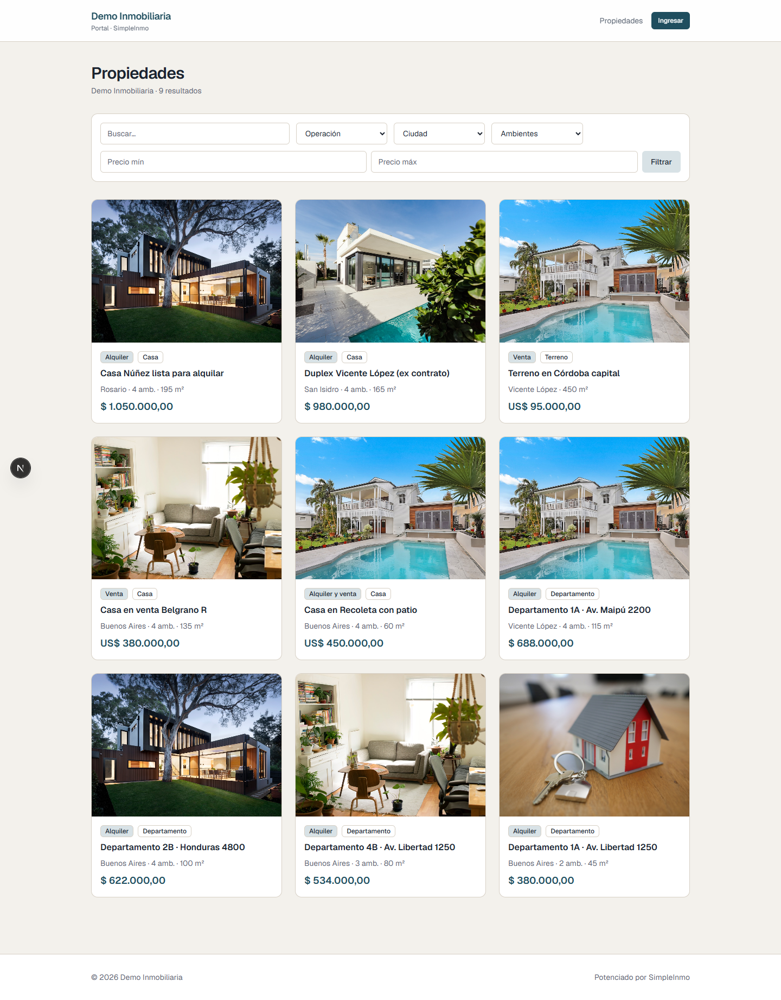

Los visitantes filtran por operación, ciudad, ambientes y precio. Solo ven propiedades publicadas.

### Ficha e agendar visita

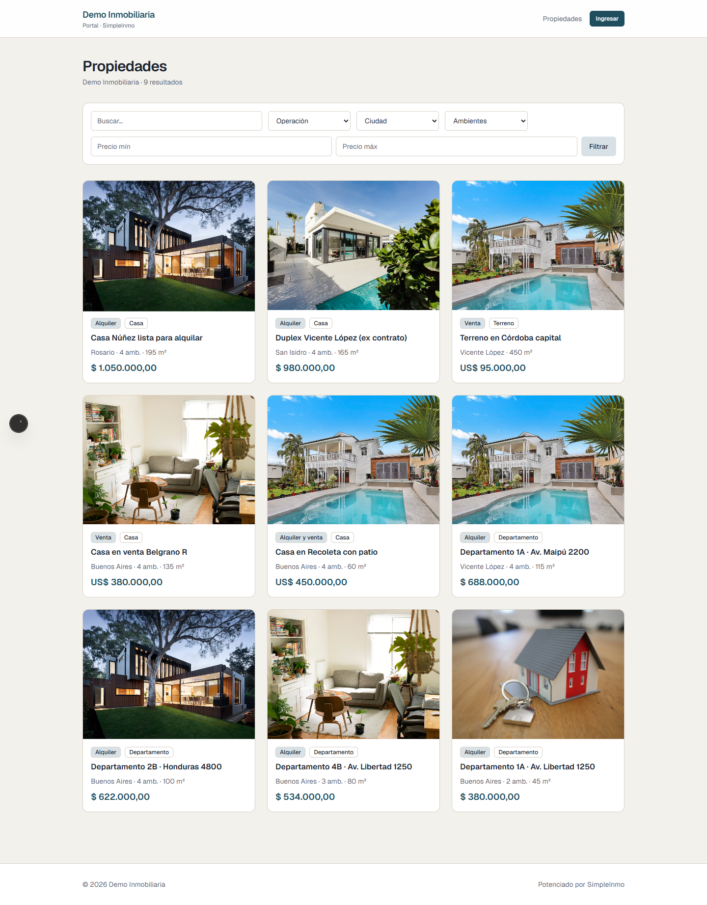

En cada ficha el interesado puede **Agendar visita**: elige día y horario disponible, deja nombre, email y teléfono.

Eso crea automáticamente:
- un turno en **Visitas**, y
- un lead en **Consultas**.

---

## 17. Flujo completo de ejemplo

Caso típico de alquiler de un departamento:

1. En **Usuarios**, creá al propietario y al futuro inquilino.
2. En **Complejos**, cargá el edificio y la unidad (con coeficiente).
3. En **Propiedades**, publicá el depto en estado **Disponible** y vinculá propietario + unidad. Subí fotos.
4. Compartí el **link del portal** desde Ajustes.
5. Un interesado agenda visita → aparece en **Visitas** y **Consultas**. Contactalo y asigná un agente.
6. Cuando concreten, creá el **Contrato** activo.
7. Cada mes: cargá **Expensas** → **Generá cuotas** en Cobros → registrá **pagos**.
8. Si hay una reparación: **Mantenimiento** → al cierre del mes, **Rendición** al propietario.

---

## 18. Preguntas frecuentes

**¿Por qué no veo una propiedad en el portal?**  
Revisá que el estado sea Disponible o Reservada y que esté publicada. Borradores, inactivas o alquiladas no se muestran.

**¿No puedo generar cuotas?**  
Necesitás contratos activos. Si incluyen expensas, cargalas antes del período.

**¿Un agente no ve Usuarios o Ajustes?**  
Es esperado: esas secciones son del administrador de la inmobiliaria.

**¿Turnero y Visitas son lo mismo?**  
No. Visitas = agenda web del portal. Turnero = fila presencial en oficina.

**¿Cómo cambio los horarios de visitas?**  
En **Visitas**, panel *Horarios y feriados* (administrador).

---

## Créditos de capturas

Las imágenes de este manual se generan con el script:

```bash
npm run dev
node scripts/capture-manual-screens.mjs
```

Quedan guardadas en `docs/manual/images/`.

*SimpleInmo — Manual de usuario*
