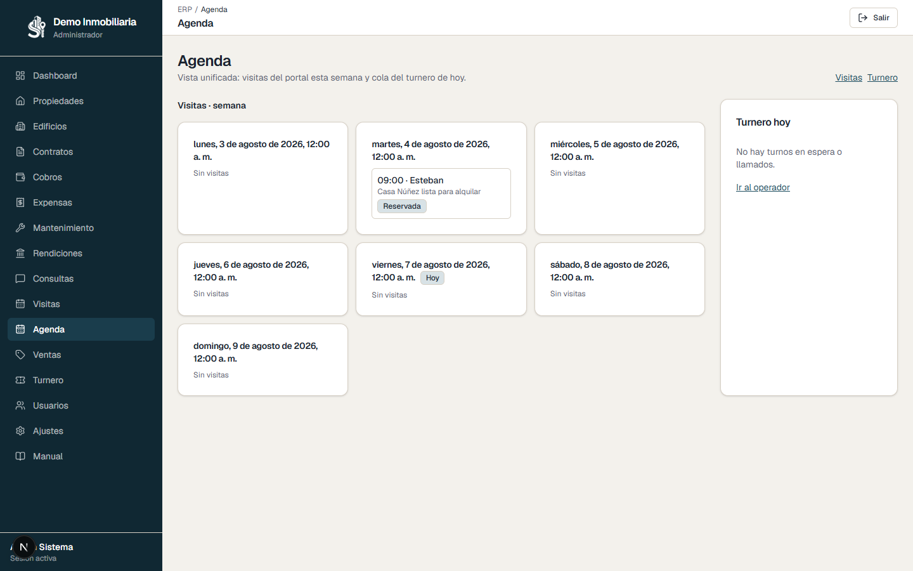
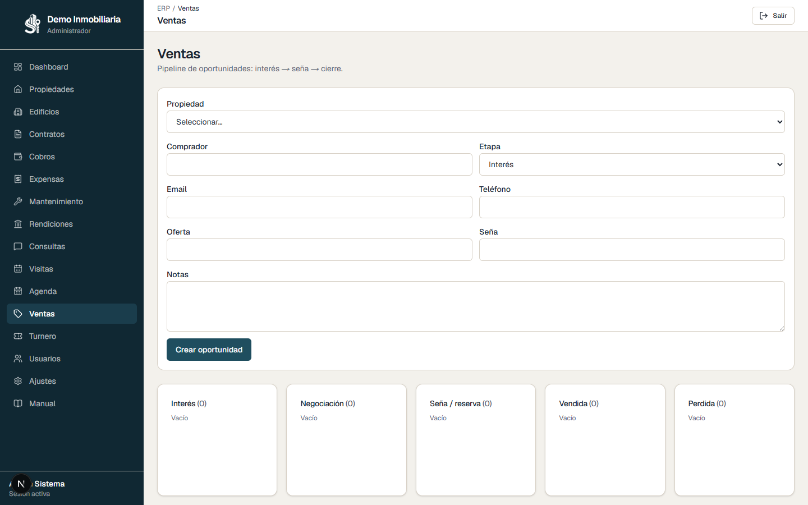

# Manual de usuario — SimpleInmo

Guía completa para operar el ERP inmobiliario de punta a punta: desde el ingreso hasta el portal público, pasando por propiedades, contratos, cobros, mantenimiento y atención comercial.

> Este manual está pensado para el equipo de la **inmobiliaria** (administrador, agentes y roles operativos). No incluye funciones de administración técnica de la plataforma SaaS.

---

## Índice

1. [Cómo empezar](#1-cómo-empezar)
2. [Orden de trabajo recomendado](#2-orden-de-trabajo-recomendado)
3. [Dashboard](#3-dashboard)
4. [Ajustes de la inmobiliaria](#4-ajustes-de-la-inmobiliaria)
5. [Usuarios y roles](#5-usuarios-y-roles)
6. [Edificios y unidades](#6-edificios-y-unidades)
7. [Propiedades](#7-propiedades)
8. [Contratos](#8-contratos)
9. [Expensas](#9-expensas)
10. [Servicios](#10-servicios)
11. [Cobros](#11-cobros)
12. [Tesorería](#12-tesorería)
13. [Obras y Mantenimiento](#13-obras-y-mantenimiento)
14. [Rendiciones](#14-rendiciones)
15. [Consultas](#15-consultas)
16. [Visitas](#16-visitas)
17. [Agenda unificada](#17-agenda-unificada)
18. [Ventas](#18-ventas)
19. [Turnero](#19-turnero)
20. [Portal público](#20-portal-público)
21. [Flujo completo de ejemplo](#21-flujo-completo-de-ejemplo)
22. [Preguntas frecuentes](#22-preguntas-frecuentes)

---

## 1. Cómo empezar

### Ingreso

1. Abrí la URL del sistema (por ejemplo `https://tu-dominio` o `http://localhost:3001` en local).
2. Ingresá tu **email** y **contraseña**.
3. Si pertenecés a más de una inmobiliaria, elegí con cuál trabajar.


### Menú lateral

Una vez dentro vas a ver el menú a la izquierda. Los ítems disponibles dependen de tu **rol** y de los **módulos** habilitados para tu usuario.

| Módulo | Para qué sirve |
|--------|----------------|
| Dashboard | Resumen del mes |
| Propiedades | Portfolio de alquiler/venta |
| Edificios | Edificios y unidades |
| Contratos | Alquileres, índices y honorarios |
| Cobros | Cuotas y pagos |
| Tesorería | Recibos, OP, caja, bancos |
| Expensas | Prorrateo de gastos del edificio |
| Servicios | Misma lógica que expensas + gasto común |
| Obras y Mantenimiento | Órdenes de trabajo |
| Rendiciones | Liquidación a propietarios |
| Consultas | Leads del portal |
| Visitas | Agenda de visitas del portal |
| Agenda | Visitas de la semana + turnero de hoy |
| Ventas | Pipeline de oportunidades de venta |
| Turnero | Turnos presenciales en sucursal |
| Usuarios | Alta de personas (solo admin) |
| Ajustes | Datos de la inmobiliaria (solo admin) |

---

## 2. Orden de trabajo recomendado

Para poner la inmobiliaria en marcha seguí este orden:

```text
Ajustes → Usuarios → Edificios/Unidades → Propiedades
        → Contratos → Expensas/Servicios → Cobros → Mantenimiento → Rendiciones
        → Portal (Consultas + Visitas)
```

1. **Configurá** la inmobiliaria (nombre, monedas, link del portal).
2. **Cargá personas**: agentes, propietarios, inquilinos, proveedores.
3. **Armá el stock**: edificios/unidades y propiedades publicables.
4. **Formalizá alquileres** con contratos.
5. **Operá el mes**: expensas/servicios → cuotas (o **Cierre del mes**) → cobros → OT → rendiciones.
6. **Atendé demanda** del portal: consultas, visitas y agenda.
7. Si vendés: oportunidades en **Ventas** (interés → seña → cierre).

---

## 3. Dashboard


El dashboard cambia según el rol:

- **Staff:** al empezar el día ves **Hoy cobré**, **Hoy pagué** (órdenes de pago) y **Qué vence** (cuotas vencidas o del día). Abajo siguen las métricas del mes.
- **Inquilino / propietario:** es tu portal. Ves contratos, saldo o rendiciones, recibos PDF y podés cargar un **reclamo de mantenimiento**.

**Cómo usarlo**
- Hacé clic en las tarjetas o filas para ir al módulo.
- Staff: priorizá lo que vence y los cobros/pagos del día antes de abrir Tesorería o Cuenta corriente.
- Inquilino: descargá el PDF de las cuotas pagadas y avisá roturas desde el mismo inicio.

---

## 4. Ajustes de la inmobiliaria

> Disponible para el rol **Administrador**.


Configurá nombre, logo, monedas, datos de contacto y el **día de vencimiento de cuotas** (1–28, por defecto 10). Ese día se usa al generar cuotas en Cobros.

Acá configurás la identidad de la empresa y el catálogo público.

**Qué configurar**
- Nombre comercial, CUIT, domicilio, teléfono, WhatsApp.
- Logo y colores (tema visual).
- Monedas habilitadas (por ejemplo ARS y USD).
- **Link del portal público** (`/i/{tu-slug}/propiedades`): copialo y compartilo en redes o WhatsApp.

**Consejo:** guardá los cambios antes de publicar propiedades. El slug forma parte de la URL pública.

---

## 5. Usuarios y roles

> Disponible para el rol **Administrador**.


Cada persona que opera el sistema (o figura como propietario/inquilino/proveedor) debe existir como usuario de la inmobiliaria.

### Alta de usuario

1. Abrí **Usuarios** → **Nuevo usuario**.
2. Completá nombre, email, contraseña y rol.
3. Marcá los módulos a los que puede acceder (si aplica).
4. Guardá.

### Roles

| Rol | Qué puede hacer |
|-----|-----------------|
| **Administrador** | Todo el menú de la inmobiliaria, usuarios y ajustes |
| **Agente** | Operación diaria: propiedades, contratos, cobros, consultas, visitas, etc. |
| **Propietario** | Ve sus propiedades, contratos, expensas y rendiciones |
| **Inquilino** | Ve sus contratos, cuotas y mantenimiento |
| **Proveedor** | Interviene en órdenes de mantenimiento |
| **Solo lectura** | Consulta limitada |

**Importante:** creá primero a los propietarios e inquilinos antes de vincularlos en propiedades o contratos.

---

## 6. Edificios y unidades


Los **edificios** agrupan **unidades** (deptos, locales) con un **coeficiente** de prorrateo para expensas.

### Pasos

1. Creá un edificio (nombre, dirección, ciudad).
2. Entrá al detalle y **agregá unidades** (código, piso, coeficiente, m², ambientes).
3. Más adelante vinculá cada unidad a una **propiedad** del portfolio.

**Tips**
- Sin coeficientes correctos, las expensas no se prorratean bien.
- Una unidad sin propiedad vinculada aparece como “sin publicar”.

---

## 7. Propiedades


### Alta

1. **Propiedades** → **Nueva propiedad**.
2. Completá título, tipo, operación (Alquiler / Venta / Ambos), precio y ubicación. Si elegís **Alquiler y venta**, cargá **precio de alquiler** y **precio de venta**, cada uno con su moneda (lo habitual: alquiler en ARS y venta en USD).
3. Asigná **propietario** y, si corresponde, la **unidad** del edificio.
4. Definí el **estado** y, si querés mostrarla en el sitio público, marcá **Publicar en el portal**.
5. Guardá. En la edición podés subir **fotos** y video. Las fotos quedan en la base de datos (si no se ven, eliminalas y volvé a subirlas).

### Filtros

Usá búsqueda por título/dirección/ciudad, estado, operación o si está en el portal.

### Relación con el portal

Solo salen en `/i/{tu-slug}/propiedades` las propiedades **marcadas para publicar** y que además estén **Disponible** o **Reservada**.

En el listado podés tildar o destildar **En portal** sin abrir la ficha. Las alquiladas, vendidas, en borrador o inactivas no se muestran aunque estén marcadas.

---

## 8. Contratos


Los contratos formalizan el alquiler: partes, montos, índices, honorarios y reglas de expensas.

### Alta de contrato

1. **Contratos** → **Nuevo contrato**.
2. Elegí propiedad (autocompleta propietario y alquiler si ya están cargados).
3. Buscá **inquilino** y **garante**. Si no existen, usá **Agregar nuevo**: pedí nombre y **DNI**; el sistema bloquea si ese DNI ya está como inquilino o garante.
4. Definí fechas, alquiler, depósito y % de mora.
5. Configurá **cada cuánto aumenta** (2, 3, 4, 6, 9 o 12 meses) y el índice (ICL, IPC, CP, mayor entre ellos, %, fijo).
6. **Honorarios inmobiliarios**:
   - Porcentaje del alquiler, o
   - Monto fijo por período, o
   - **Porcentaje sobre el total del contrato**: indicá el % y en **cuántas cuotas** se paga. El sistema calcula alquiler × meses × % y genera la parte del inquilino en esas cuotas con vencimiento el **día 10**.
7. Marcá si incluye expensas ordinarias/extraordinarias.
8. Guardá: el contrato queda **Activo**, la propiedad pasa a **Alquilada** y se generan automáticamente las **cuotas de alquiler** (vencimiento día 10) de todo el período.

### Índices IPC / ICL / CP

En la lista de Contratos (staff):

1. Cargá **año**, **mes**, **período** (2/3/4/6/9/12 meses) y los % acumulados de IPC, ICL y CP.
2. Pulsá **Aplicar los índices**.
3. El sistema guarda el registro y toma el **mayor %** entre los tres.
4. Ese % se aplica a los contratos activos de ese período cuya **próxima actualización** sea el **mes siguiente** (ej.: inicio en enero, cada 6 meses → aumento en julio; se carga en junio).
5. Las cuotas abiertas desde esa vigencia se recalculan con el nuevo alquiler.
6. Usá **Ver índices cargados** para consultar/filtrar lo ya guardado (año, mes, período).

### Detalle del contrato

- Ves el **alquiler vigente** (incluye ajustes ya aplicados).
- Staff puede **aplicar un ajuste** a mano (o dejar el % vacío para tomar índices cargados).
- Card de **Depósito / garantía**: en custodia, devolver, o **Aplicar a saldo**.
- **Garantes:** en un contrato ya creado podés cambiar la cantidad, agregar, reemplazar o quitar garantes (y dar de alta uno nuevo con DNI).
- **Archivos del contrato:** adjuntá o eliminá contrato escrito, DNI, recibos de sueldo u otros en cualquier momento.
- Al pasar a **Rescindido** o **Vencido**, la propiedad vuelve a Disponible (si no hay otro contrato activo).

**Tips**
- El período del contrato debe coincidir con el período de índices que vayas a cargar.
- Quién paga honorarios (inquilino / propietario / reparto) define qué parte entra en la cuota del inquilino.

## 9. Expensas


Cargás los **gastos del período** (agua, gas, luz, tasa, obras u otros) aplicados a un edificio o a una propiedad, y generás las expensas.

### Cómo cargar gastos

1. Elegí alcance: **edificio** (se prorratea por m²) o **propiedad** (solo esa unidad).
2. Categoría, concepto, período y monto.
3. Confirmá la carga.

### Generar expensas

En **Generar expensas** elegí el alcance:

- **Un edificio**: prorratea gastos del edificio por m² y suma gastos de cada propiedad.
- **Una propiedad**: solo con los gastos cargados a esa propiedad.
- **Todas las pendientes**: recorre edificios y propiedades con gastos sin documentos del período.

Obras van como **extraordinarias**; el resto como **ordinarias**. Si ya hay documentos emitidos para ese alcance, el sistema lo bloquea.

**Orden sugerido del mes:** primero gastos → generar expensas → (opcional) servicios → revisar cuotas en Cobros.

## 10. Servicios

Misma lógica que **Expensas**, con la categoría extra **Gasto común**.

1. Cargá gastos del período (incluye gasto común) a edificio o propiedad.
2. Generá servicios por edificio, por propiedad o **todas las pendientes**.
3. Al generar, se actualizan las cuotas abiertas del período.
4. En Cobros, los montos de servicios aparecen como conceptos **Servicios** / **Servicios extraordinarios**, separados de las expensas.

Los ledgers no se mezclan: un período puede tener documentos de Expensas y de Servicios a la vez.

## 11. Cobros


Acá viven las **cuotas** (alquiler + expensas + servicios + honorarios + mora) y el registro de pagos.

Staff puede **Exportar morosos** (CSV) desde Cobros o Cuenta corriente.

### Generar cuotas del período

1. Como staff, usá **Generar cuotas del período** (o el cierre del mes).
2. Elegí año y mes.
3. El sistema arma (o actualiza) las cuotas de contratos activos. Al **crear un contrato** ya se generan todas las cuotas del período con vencimiento día 10.

### Cierre del mes

**Ejecutar cierre del mes** genera las cuotas del mes en curso y sincroniza vencimientos/mora.

### Cuenta corriente del inquilino

1. Abrí la cuenta del inquilino.
2. En cada cuota podés tildar conceptos: **Alquiler**, **Expensas ordinarias/extraordinarias**, **Servicios**, **Honorarios**, **Mora**, etc.
3. Solo se pueden tildar conceptos que entren en el monto a aplicar; el resto queda como saldo.

### Registrar un pago

1. Desde la cuota o la cuenta corriente.
2. Indicá monto, medio, referencia y notas.
3. Descargá el recibo PDF si lo necesitás.

**Estados de cuota:** Pendiente · Parcial · Pagada · Vencida · Cancelada.


## 12. Tesorería

Módulo operativo de dinero de la inmobiliaria (staff): recibos, órdenes de pago, caja, bancos y cheques. El menú **Tesorería** apunta a `/tesoreria`.

### Conceptos

- **Recibo**: cobro (ingreso). Ciclo borrador → emitido → **imputado** → anulado.
- **Orden de pago (OP)**: egreso a proveedor, propietario u otro beneficiario.
- **Caja diaria**: se abre por día/moneda; el efectivo de recibos/OP impacta acá.
- **Caja tesorería**: recibe cierres de caja diaria y movimientos de control.
- **Bancos**: cuentas propias; transferencias y depósitos.
- **Cheques**: cartera de terceros y cheques propios.

### Flujo típico de cobro

1. Abrí **Caja** y una sesión diaria (si vas a cobrar en efectivo).
2. **Recibos → Nuevo**: inquilino o nombre libre, líneas (contrato/propiedad), medios de pago.
3. Podés aplicar el recibo a **cuotas abiertas**; al imputar se generan pagos en Cobros.
4. Imprimí o descargá el PDF del recibo.

### Flujo típico de pago

1. **Órdenes de pago → Nueva**: proveedor o beneficiario, líneas y medios.
2. Aplicá a facturas de mantenimiento o a **rendiciones** pendientes.
3. Al imputar, se actualiza el estado de esas facturas/rendiciones.

### Bancos y cheques

- En **Ajustes** das de alta las cuentas bancarias.
- **Depositar**: efectivo desde caja o cheques de cartera hacia un banco.
- **Cheques**: cartera, entrega en OP, depósito, rechazo y débito de cheques propios.

Los cobros rápidos desde `/cobros` siguen disponibles en paralelo.

## 13. Obras y Mantenimiento


Gestioná **órdenes de trabajo** (reparaciones) y facturas de proveedores.

### Crear una OT

1. Título y propiedad.
2. Proveedor (usuario con rol Proveedor), si ya lo tenés.
3. Quién asume el costo: deducible propietario / inquilino / agencia.
4. Detalle del trabajo.

### Ciclo de vida

`Abierta → Asignada → En curso → Completada` (o Cancelada).

Los trabajos a cargo del propietario suelen impactar la **rendición**.

---

## 14. Rendiciones


Liquidación al propietario del período:

**Alquiler cobrado − comisión − reparaciones − extraordinarias = neto a transferir.**

### Pasos

1. **Generar liquidación** (propietario, período, moneda).
2. Revisá el detalle (bruto, comisión, neto y líneas).
3. **Emitir** cuando esté correcta.
4. **Marcar pagada** al hacer la transferencia (podés cargar referencia).
5. Descargá el **PDF** para enviar al propietario.
6. Staff: **Exportar CSV** de todas las rendiciones.

El propietario también entra a sus rendiciones desde el dashboard y descarga el PDF.

También podés **Generar todas (ARS)** para crear borradores de todos los propietarios del período.

---

## 15. Consultas


Inbox de interesados que escriben o agendan desde el **portal**.

**Qué hacer con cada consulta**
1. Leé el mensaje y la propiedad asociada.
2. Avanzá el estado: Nuevo → Contactado → Calificado → Convertido (o Cerrado).
3. Si viene de una visita, también revisá la agenda en **Visitas**.

---

## 16. Visitas


Agenda de turnos que los interesados reservan en la ficha pública.

### Configurar horarios (administrador)

En **Horarios y feriados** podés definir:
- Días de atención (por defecto lun–vie).
- Rango horario (por defecto 8:00–16:00, turnos de 1 hora).
- Feriados inamovibles de Argentina (desmarcá si ese día sí atienden).
- Días cerrados extra (puentes, vacaciones).

### Operar la agenda

- Cambiá entre vista **Calendario** y **Lista**.
- Asigná un **agente** a cada visita.
- Marcá **Completada** o **Cancelada** según corresponda.

Cada reserva también genera una **consulta** vinculada.

---

## 17. Agenda unificada



Vista de apoyo del día/semana:
- **Visitas** de la semana (con horario).
- **Turnero de hoy**: turnos en espera o llamados (cola presencial, sin hora fija).

No reemplaza Visitas ni Turnero: es un tablero para ver ambos juntos. Links rápidos a cada módulo.

---

## 18. Ventas



Pipeline para propiedades en **Venta** o **Ambos**:

1. Creá una **oportunidad** (comprador, oferta, seña, % de comisión y fecha de boleto).
2. Marcá **Seña cobrada** cuando el dinero entra.
3. Mové las etapas: Interés → Negociación → Seña/reserva → Vendida (o Perdida).
4. Al pasar a **Seña**, la propiedad pasa a **Reservada**; al **Vendida**, a **SOLD** (sale del portal).
5. La comisión se calcula como % sobre la oferta.

Desde la ficha de una propiedad de venta: botón **Crear oportunidad**.

---

## 19. Turnero


Cola de atención **presencial** en la sucursal (distinta de las visitas del portal web).

Abrí según el dispositivo:
- **Tótem** — el visitante saca turno.
- **Pantalla** — sala de espera.
- **Operador** — atender la cola.

---

## 20. Portal público

El portal es la cara web de tu inmobiliaria. El link se obtiene desde **Ajustes**.

### Catálogo


Los visitantes filtran por operación, ciudad, ambientes y precio. Solo ven propiedades publicadas (Disponible / Reservada). Si la ficha es alquiler y venta, se muestran ambos precios, cada uno en su moneda.

### Ficha e agendar visita


En cada ficha el interesado puede **Agendar visita**: elige día y horario disponible, deja nombre, email y teléfono.

Eso crea automáticamente:
- un turno en **Visitas**, y
- un lead en **Consultas**.

---

## 21. Flujo completo de ejemplo

Caso típico de alquiler de un departamento:

1. En **Usuarios**, creá al propietario y al futuro inquilino.
2. En **Edificios**, cargá el edificio y la unidad (con coeficiente).
3. En **Propiedades**, publicá el depto en estado **Disponible** y vinculá propietario + unidad. Subí fotos.
4. Compartí el **link del portal** desde Ajustes.
5. Un interesado agenda visita → aparece en **Visitas**, **Agenda** y **Consultas**. Contactalo y asigná un agente.
6. Cuando concreten, creá el **Contrato** activo (depósito en custodia).
7. Cada mes: cargá **Expensas** → **Cierre del mes** o generá cuotas en Cobros → registrá **pagos** → **Rendiciones**.
8. Si hay una reparación: **Mantenimiento** → al cierre del mes, **Rendición** al propietario.
9. Al terminar el alquiler: estado Rescindido/Vencido, devolvé o aplicá el **depósito**.

Caso de venta: propiedad SALE → **Ventas** → seña (Reservada) → Vendida.

---

## 22. Preguntas frecuentes

**¿Por qué no veo una propiedad en el portal?**  
Revisá que el estado sea Disponible o Reservada y que esté publicada. Borradores, inactivas o alquiladas no se muestran.

**¿No puedo generar cuotas?**  
Necesitás contratos activos. Si incluyen expensas, cargalas antes del período. El día de vencimiento se configura en Ajustes.

**¿Un agente no ve Usuarios o Ajustes?**  
Es esperado: esas secciones son del administrador de la inmobiliaria.

**¿Turnero, Visitas y Agenda son lo mismo?**  
No. Visitas = agenda web del portal. Turnero = fila presencial. Agenda = vista unificada de apoyo.

**¿Cómo cambio los horarios de visitas?**  
En **Visitas**, panel *Horarios y feriados* (administrador).

**¿Dónde está el pipeline de venta?**  
Menú **Ventas**. Solo aplica a propiedades con operación Venta o Ambos.

---


### ¿Cómo actualizo alquileres con IPC/ICL/CP?

Cargá los % del período en Contratos y pulsá **Aplicar los índices**. Se usa el mayor entre IPC, ICL y CP, y se aplica a los contratos que deban aumentar el mes siguiente.

### ¿Dónde veo los servicios en el cobro?

En la cuenta corriente del inquilino, al abrir la cuota, aparecen como **Servicios** (y **Servicios extraordinarios** si hay obras), aparte de las expensas.

### ¿Puedo crear un inquilino al armar el contrato?

Sí: en el buscador de inquilino/garante usá **Agregar nuevo** e ingresá el DNI. Si ya existe como inquilino o garante, el sistema lo avisa.

## Créditos de capturas

Las imágenes de este manual se generan con el script:

```bash
npm run dev
node scripts/capture-manual-screens.mjs
```

Quedan guardadas en `docs/manual/images/` y `public/manual/images/`.

*SimpleInmo — Manual de usuario*
